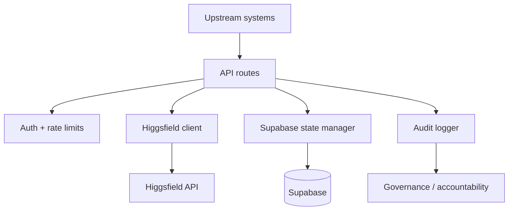

# Higgsfield-Integration-Layer

Higgsfield API bridge, job orchestration, and media management for VisionWeaver, CEO Dashboard, and the EstibanCreations ecosystem.

## What this repo now includes

- Edge-compatible TypeScript API routes for image generation, video generation, job management, media search, and credit controls.
- Middleware for API key/JWT auth and per-project rate limiting.
- Utilities for Higgsfield API access, Supabase lifecycle persistence, and governance audit logging.
- Supabase SQL schema and TypeScript interfaces for generations, media library, credit transactions, and job state.
- Workflow YAML definitions for book creation, film production, social campaigns, and commerce integration.
- Core architecture, API, integration, workflow, and governance documentation.

## Quick start

1. Copy `.env.example` to `.env` and fill in Higgsfield and Supabase credentials.
2. Apply `schemas/migrations/001_create_core_tables.sql` to your Supabase database.
3. Install dependencies with `npm install`.
4. Validate the scaffold with `npm run build`.

## Architecture

## Integration examples

- **VisionWeaver** posts to `generate-image` and `generate-video` for books, films, and campaigns.
- **MASTER_CEO_DASHBOARD** polls `manage-jobs` and surfaces `credits-management` insights.
- **Master-System-Buildout** consumes structured audit output and workflow definitions.

See `/docs` for full details.

## Avatar State and animation production — October 3, 2026

The [repository integration contract](docs/AVATAR-STATE-ANIMATION-HANDOFF.md) links Avatar State v1.1 and children's animation/teaching v1.0: three boards, reconciled coverage, actual avatar references, scoped changes, perception/contact/reaction timing, world/camera anchors, vehicle/enclosure continuity and evidence-based acceptance. Documentation is synchronized; camera calibration and runtime/production verification remain open.
