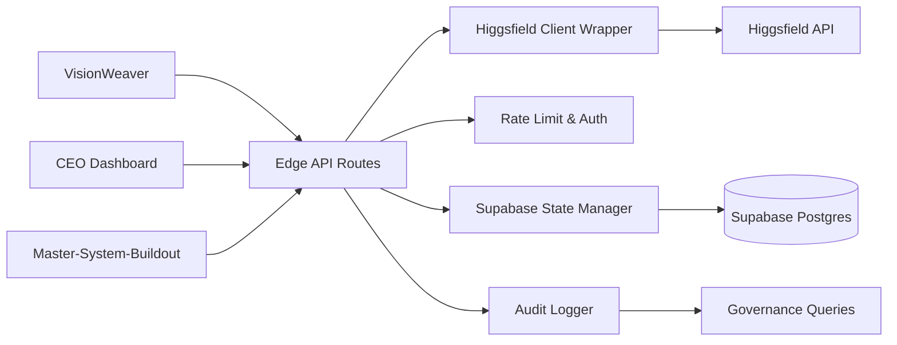

# Architecture

## Overview

Higgsfield Integration Layer provides a shared generation backend for VisionWeaver, MASTER_CEO_DASHBOARD, and Master-System-Buildout.

## Design Decisions

- **Hybrid runtime**: Edge-compatible route handlers for request/response workloads and an Express-friendly TypeScript shape for backend reuse.
- **Supabase persistence**: durable lifecycle tracking for generations, media, credits, and resumable jobs.
- **Type-safe contracts**: Zod validates inbound requests and shared TypeScript types keep route responses consistent.
- **Governance-ready audit**: every route emits structured audit events aligned with Master-System-Buildout accountability requirements.

## Data Flow

1. Upstream system submits a generation request with API key or CEO Dashboard JWT.
2. Auth middleware validates caller identity and route permissions.
3. Rate limiting enforces per-user/per-project throughput and concurrent queue caps.
4. Higgsfield client checks balance, calls remote generation APIs, and retries once after token refresh.
5. Supabase stores generation, media, credit, and job-state metadata.
6. Audit logger emits structured records for downstream governance and accountability queries.

## Deployment Notes

- Deploy `api/routes/*.ts` on Vercel for stateless access patterns.
- Reuse the same modules in a persistent Node service when you need background workers, scheduled polling, or social publishing orchestration.
- Apply SQL in `schemas/migrations/001_create_core_tables.sql` before enabling write traffic.
